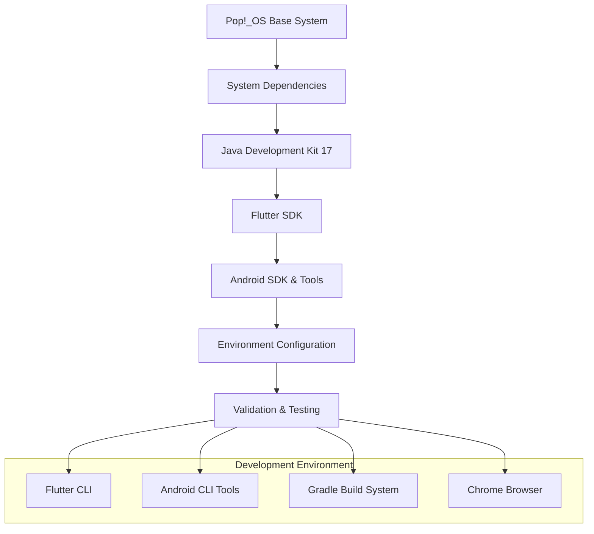

# Flutter Android Build Environment Design

## Overview

This design document outlines the architecture and implementation approach for setting up a complete Flutter Android development environment on Pop!_OS. The solution follows a sequential installation pattern with validation checkpoints to ensure each component is properly configured before proceeding to the next step.

## Architecture

### System Layer Architecture



### Installation Flow

The setup follows a dependency-first approach where each component builds upon the previous:

1. **Base System Preparation**: Update package manager and install core utilities
2. **Java Runtime Setup**: Install and configure OpenJDK-17 as the primary Java environment
3. **Flutter SDK Installation**: Download, extract, and configure Flutter with Dart
4. **Android SDK Setup**: Install Android SDK, platform tools, and build tools
5. **Environment Configuration**: Set up PATH and environment variables persistently
6. **Validation Phase**: Create and test Hello World application on multiple targets

## Components and Interfaces

### 1. System Package Manager Interface

**Component**: APT Package Manager Integration
- **Purpose**: Install system-level dependencies through Ubuntu's package manager
- **Dependencies**: Git, Curl, Unzip, Zip, OpenJDK-17-JDK
- **Configuration**: Automatic dependency resolution and installation
- **Validation**: Verify package installation through `dpkg -l` queries

### 2. Flutter SDK Manager

**Component**: Flutter SDK Installation and Configuration
- **Installation Method**: Direct download from Flutter's stable channel
- **Location**: `/opt/flutter` (system-wide) or `$HOME/flutter` (user-specific)
- **PATH Integration**: Add Flutter bin directory to system PATH
- **Validation**: `flutter doctor` command execution and health check

### 3. Android SDK Manager

**Component**: Android SDK and Build Tools
- **Installation Method**: Flutter's built-in Android SDK management or manual cmdline-tools
- **Components Required**:
  - Android SDK Platform (latest stable API level)
  - Android SDK Build-tools (latest version)
  - Android SDK Platform-tools (ADB, Fastboot)
  - Android SDK Command-line tools
- **Environment Variables**: ANDROID_HOME, ANDROID_SDK_ROOT
- **License Management**: Automatic acceptance of SDK licenses

### 4. Environment Configuration Manager

**Component**: Persistent Environment Setup
- **Configuration Files**: 
  - `~/.bashrc` or `~/.zshrc` for shell-specific configuration
  - `/etc/environment` for system-wide variables (if needed)
- **Variables to Configure**:
  - `PATH` (Flutter, Android SDK tools)
  - `ANDROID_HOME`
  - `ANDROID_SDK_ROOT`
  - `JAVA_HOME` (if not automatically set)

## Data Models

### Environment Configuration Schema

```bash
# Flutter Configuration
export PATH="$PATH:/opt/flutter/bin"

# Android SDK Configuration  
export ANDROID_HOME="$HOME/Android/Sdk"
export ANDROID_SDK_ROOT="$ANDROID_HOME"
export PATH="$PATH:$ANDROID_HOME/cmdline-tools/latest/bin"
export PATH="$PATH:$ANDROID_HOME/platform-tools"
export PATH="$PATH:$ANDROID_HOME/build-tools/latest"

# Java Configuration (if needed)
export JAVA_HOME="/usr/lib/jvm/java-17-openjdk-amd64"
```

### Project Structure Template

```
flutter-hello-world/
├── android/
│   ├── app/
│   │   ├── build.gradle
│   │   └── src/main/AndroidManifest.xml
│   ├── gradle/
│   └── build.gradle
├── lib/
│   └── main.dart
├── web/
├── pubspec.yaml
└── README.md
```

## Error Handling

### Installation Failure Recovery

1. **Network Connectivity Issues**:
   - Implement retry logic for downloads
   - Provide alternative download mirrors
   - Cache downloaded files to avoid re-downloading

2. **Permission Errors**:
   - Use appropriate sudo privileges for system-wide installations
   - Fallback to user-directory installations when system installation fails
   - Clear permission guidance for directory access

3. **Dependency Conflicts**:
   - Check for existing Java installations and manage conflicts
   - Validate Android SDK path conflicts
   - Provide cleanup procedures for partial installations

4. **Environment Variable Issues**:
   - Validate shell configuration file permissions
   - Backup existing configuration before modifications
   - Provide manual configuration steps as fallback

### Validation Failure Handling

1. **Flutter Doctor Issues**:
   - Parse flutter doctor output for specific error identification
   - Provide targeted fixes for common issues (licenses, paths, etc.)
   - Escalate to manual intervention with clear instructions

2. **Build Failures**:
   - Gradle daemon issues: Clear gradle cache and restart daemon
   - SDK version mismatches: Update to compatible versions
   - Missing dependencies: Install additional required packages

## Testing Strategy

### Automated Validation Tests

1. **Component Installation Verification**:
   ```bash
   # Verify Flutter installation
   flutter --version
   flutter doctor -v
   
   # Verify Android SDK
   adb version
   sdkmanager --list_installed
   
   # Verify Java
   java -version
   javac -version
   ```

2. **Hello World Application Tests**:
   ```bash
   # Create test project
   flutter create hello_world_test
   cd hello_world_test
   
   # Test web build
   flutter run -d chrome --web-port=8080
   
   # Test Android build (with device connected)
   flutter run -d android
   
   # Test production builds
   flutter build apk --release
   flutter build appbundle --release
   ```

### Manual Validation Checklist

1. **Environment Verification**:
   - [ ] All PATH variables correctly set and persistent
   - [ ] Flutter doctor shows no critical issues
   - [ ] Android licenses accepted
   - [ ] ADB can detect connected devices

2. **Build Verification**:
   - [ ] Hello World app runs in Chrome browser
   - [ ] Hello World app installs and runs on Android device
   - [ ] Release APK builds successfully
   - [ ] Release AAB builds successfully
   - [ ] Generated packages are valid and installable

### Performance Considerations

1. **Download Optimization**:
   - Use stable Flutter channel for reliability
   - Download minimal required Android SDK components initially
   - Implement parallel downloads where possible

2. **Storage Management**:
   - Flutter SDK: ~1.5GB
   - Android SDK (minimal): ~3-4GB
   - Build cache and dependencies: ~1-2GB
   - Total estimated space: ~6-8GB

3. **Build Performance**:
   - Configure Gradle daemon for faster subsequent builds
   - Set appropriate JVM heap size for Gradle
   - Enable Gradle build cache

## Security Considerations

1. **Download Verification**:
   - Verify SHA checksums for downloaded SDKs
   - Use HTTPS for all downloads
   - Download from official sources only

2. **File Permissions**:
   - Set appropriate permissions for SDK directories
   - Avoid running builds with unnecessary elevated privileges
   - Secure keystore generation and storage for app signing

3. **Environment Isolation**:
   - Use user-specific installations when possible
   - Avoid modifying system-wide configurations unnecessarily
   - Provide cleanup procedures for complete removal