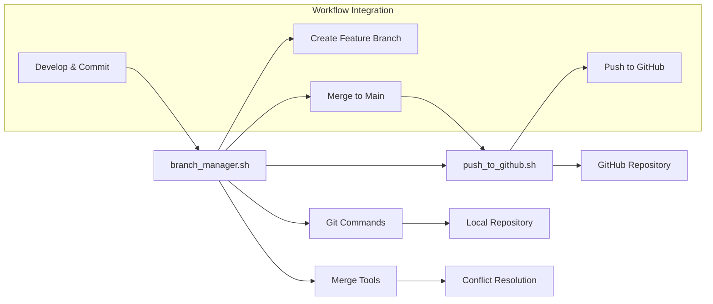

# Git Branch Manager Design

## Overview

The Git Branch Manager is a comprehensive bash script that provides intelligent branch management capabilities, building upon the existing push_to_github.sh foundation. The system implements a modular architecture with safety-first operations, automated conflict resolution, and seamless integration with remote repositories.

## Architecture

### System Architecture

```mermaid
graph TB
    A[branch_manager.sh] --> B[Core Operations Module]
    A --> C[Safety Checks Module]
    A --> D[Remote Sync Module]
    A --> E[Conflict Resolution Module]
    A --> F[Interactive UI Module]
    
    B --> G[Branch Creation]
    B --> H[Branch Switching]
    B --> I[Branch Merging]
    B --> J[Branch Cleanup]
    
    C --> K[Working Tree Validation]
    C --> L[Repository State Checks]
    C --> M[Backup Operations]
    
    D --> N[Remote Fetch]
    D --> O[Upstream Tracking]
    D --> P[Push/Pull Operations]
    
    E --> Q[Conflict Detection]
    E --> R[Auto-Resolution]
    E --> S[Manual Resolution Tools]
    
    F --> T[Menu System]
    F --> U[Status Display]
    F --> V[User Prompts]
```



### Integration with Existing Tools



## Components and Interfaces

### 1. Core Operations Module

**Component**: Branch Management Engine
- **Branch Creation**: Creates feature branches with automatic base branch sync
- **Branch Switching**: Safe branch switching with stash management
- **Branch Merging**: Intelligent merge operations with conflict handling
- **Branch Cleanup**: Automated cleanup of merged branches

**Interface Functions**:
```bash
create_branch(branch_name, base_branch)
switch_branch(target_branch, stash_option)
merge_branch(source_branch, target_branch, merge_strategy)
cleanup_branches(dry_run_flag)
```

### 2. Safety Checks Module

**Component**: Repository State Validator
- **Working Tree Validation**: Ensures clean state before operations
- **Repository Integrity**: Validates Git repository structure
- **Backup Operations**: Creates safety backups before destructive operations

**Interface Functions**:
```bash
validate_working_tree()
check_repository_state()
create_safety_backup(operation_type)
restore_from_backup(backup_id)
```

### 3. Remote Sync Module

**Component**: Remote Repository Manager
- **Fetch Operations**: Retrieves latest changes from remote
- **Upstream Tracking**: Manages branch upstream relationships
- **Sync Validation**: Ensures local and remote are synchronized

**Interface Functions**:
```bash
fetch_remote_changes()
sync_with_upstream(branch_name)
validate_remote_connectivity()
setup_upstream_tracking(branch_name, remote_branch)
```

### 4. Conflict Resolution Module

**Component**: Intelligent Conflict Handler
- **Conflict Detection**: Identifies and categorizes merge conflicts
- **Auto-Resolution**: Handles simple conflicts automatically
- **Manual Resolution**: Provides tools for complex conflicts

**Interface Functions**:
```bash
detect_conflicts()
auto_resolve_conflicts(conflict_type)
launch_merge_tool(conflict_files)
validate_resolution()
```

### 5. Interactive UI Module

**Component**: User Interface Manager
- **Menu System**: Provides interactive operation selection
- **Status Display**: Shows current repository and branch status
- **User Prompts**: Handles user input and confirmations

**Interface Functions**:
```bash
show_main_menu()
display_branch_status()
prompt_user_confirmation(message)
show_operation_preview(operation_details)
```

## Data Models

### Configuration Schema

```bash
# Branch Manager Configuration
BRANCH_MANAGER_CONFIG="$HOME/.config/branch_manager/config"

# Default settings
DEFAULT_BASE_BRANCH="main"
DEFAULT_WORKFLOW="github-flow"
AUTO_CLEANUP_MERGED="true"
CONFLICT_RESOLUTION_TOOL="code --wait"
BACKUP_RETENTION_DAYS="7"

# Workflow patterns
WORKFLOW_PATTERNS=(
    "github-flow:feature/,hotfix/"
    "gitflow:feature/,develop/,release/,hotfix/"
    "custom:feat/,fix/,chore/"
)
```

### Branch Information Schema

```bash
# Branch metadata structure
declare -A BRANCH_INFO=(
    ["name"]=""
    ["type"]=""           # feature, hotfix, release
    ["base_branch"]=""    # origin branch
    ["upstream"]=""       # remote tracking branch
    ["status"]=""         # ahead, behind, up-to-date
    ["last_commit"]=""    # latest commit hash
    ["created_date"]=""   # branch creation timestamp
)
```

### Operation Log Schema

```bash
# Operation logging structure
LOG_ENTRY_FORMAT="{timestamp}|{operation}|{branch}|{status}|{details}"

# Example log entries
# 2024-10-27T10:30:00|CREATE_BRANCH|feature/user-auth|SUCCESS|Created from main
# 2024-10-27T10:35:00|MERGE_BRANCH|feature/user-auth->main|CONFLICT|3 files conflicted
# 2024-10-27T10:40:00|RESOLVE_CONFLICT|feature/user-auth|SUCCESS|Auto-resolved whitespace
```

## Error Handling

### Repository State Errors

1. **Dirty Working Tree**:
   - Detect uncommitted changes
   - Offer stash, commit, or discard options
   - Prevent destructive operations until resolved

2. **Detached HEAD State**:
   - Detect detached HEAD condition
   - Guide user to create branch or checkout existing branch
   - Prevent branch operations in detached state

3. **Repository Corruption**:
   - Validate Git repository integrity
   - Offer repair options using git fsck
   - Escalate to manual intervention if needed

### Remote Repository Errors

1. **Network Connectivity Issues**:
   - Test remote connectivity before operations
   - Implement retry logic with exponential backoff
   - Provide offline mode for local-only operations

2. **Authentication Failures**:
   - Detect authentication issues
   - Guide user through credential setup
   - Support multiple authentication methods (SSH, HTTPS, token)

3. **Remote Branch Conflicts**:
   - Detect when remote has diverged
   - Offer rebase or merge strategies
   - Provide conflict resolution guidance

### Merge Conflict Handling

1. **Conflict Categorization**:
   ```bash
   # Simple conflicts (auto-resolvable)
   - Whitespace differences
   - Line ending variations
   - Simple addition conflicts
   
   # Complex conflicts (manual resolution)
   - Logic conflicts
   - Structural changes
   - Binary file conflicts
   ```

2. **Resolution Strategies**:
   - Automatic resolution for simple conflicts
   - Interactive resolution for complex conflicts
   - Rollback options if resolution fails

## Testing Strategy

### Unit Testing Framework

```bash
# Test framework structure
test_branch_creation() {
    # Setup test repository
    # Test branch creation with various scenarios
    # Validate branch exists and has correct upstream
    # Cleanup test environment
}

test_conflict_resolution() {
    # Create conflicting branches
    # Test auto-resolution capabilities
    # Validate manual resolution workflow
    # Verify final merge state
}
```

### Integration Testing

1. **End-to-End Workflow Tests**:
   - Complete feature branch lifecycle
   - Multi-branch merge scenarios
   - Remote synchronization workflows

2. **Error Scenario Testing**:
   - Network failure simulation
   - Repository corruption scenarios
   - Authentication failure handling

### Manual Testing Checklist

1. **Branch Operations**:
   - [ ] Create feature branch from main
   - [ ] Switch between branches with uncommitted changes
   - [ ] Merge feature branch with conflicts
   - [ ] Delete merged branches

2. **Remote Synchronization**:
   - [ ] Sync with remote before operations
   - [ ] Handle remote branch updates
   - [ ] Resolve upstream conflicts

3. **Safety Features**:
   - [ ] Prevent operations on dirty working tree
   - [ ] Create and restore from backups
   - [ ] Validate all safety prompts

## Security Considerations

### Repository Safety

1. **Backup Strategy**:
   - Create automatic backups before destructive operations
   - Implement backup rotation and cleanup
   - Provide easy restoration mechanisms

2. **Operation Validation**:
   - Require explicit confirmation for destructive operations
   - Validate all user inputs to prevent injection attacks
   - Implement operation logging for audit trails

### Remote Repository Security

1. **Credential Management**:
   - Never store credentials in scripts
   - Use system credential managers
   - Support secure authentication methods

2. **Remote Validation**:
   - Verify remote repository URLs
   - Validate SSL certificates for HTTPS connections
   - Implement rate limiting for API calls

## Performance Considerations

### Optimization Strategies

1. **Git Operations**:
   - Use shallow clones for temporary operations
   - Implement parallel fetch operations where possible
   - Cache frequently accessed Git information

2. **User Experience**:
   - Provide progress indicators for long operations
   - Implement operation timeouts with user feedback
   - Optimize interactive menu response times

### Resource Management

1. **Memory Usage**:
   - Limit concurrent Git operations
   - Clean up temporary files and branches
   - Monitor script memory consumption

2. **Disk Space**:
   - Implement backup cleanup policies
   - Monitor repository size growth
   - Provide disk space warnings

## Integration Points

### Existing Script Integration

1. **push_to_github.sh Integration**:
   - Call push script after successful merges
   - Share configuration and repository information
   - Maintain consistent error handling patterns

2. **Development Workflow**:
   - Integrate with IDE Git plugins
   - Support CI/CD pipeline triggers
   - Provide hooks for custom automation

### External Tool Support

1. **Merge Tools**:
   - Support popular merge tools (VS Code, Sublime Merge, KDiff3)
   - Configurable merge tool preferences
   - Fallback to command-line tools

2. **Notification Systems**:
   - Desktop notifications for operation completion
   - Integration with team communication tools
   - Email notifications for critical operations