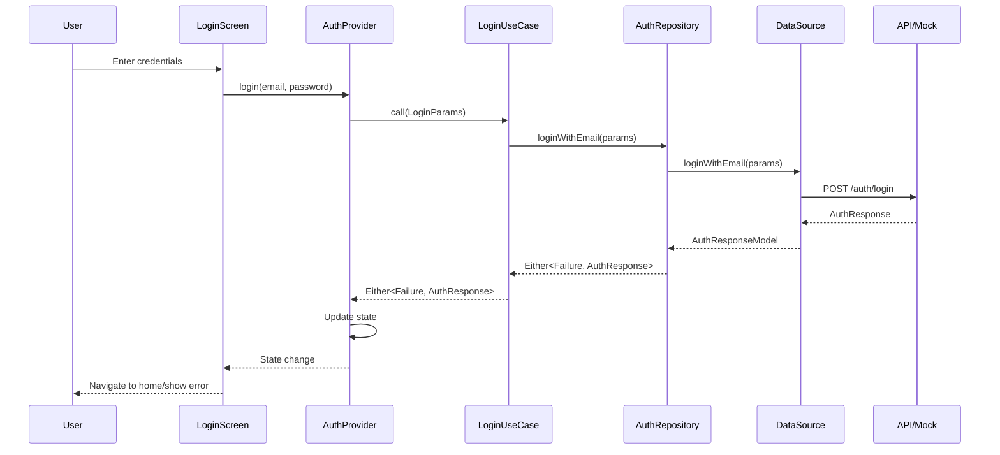
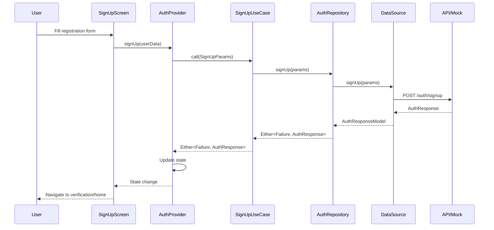

# Authentication Feature Documentation

> **AI Maintenance Prompt**: This documentation should be updated whenever files in the `lib/features/auth/` directory are modified. Monitor changes to authentication entities, use cases, repositories, data sources, models, screens, widgets, and providers. Update this documentation to reflect new authentication methods, security enhancements, UI changes, API integrations, error handling improvements, and user flow modifications. Keep the authentication flow diagrams, security considerations, and integration examples current with the actual implementation.

## Overview

The Authentication feature handles user authentication, authorization, and session management in the GullyCric application. It follows Clean Architecture principles with clear separation between presentation, domain, and data layers.

## Architecture

```
lib/features/auth/
├── data/
│   ├── datasources/         # Data access layer
│   ├── models/              # Data models with JSON serialization
│   └── repositories/        # Repository implementations
├── domain/
│   ├── entities/            # Business entities
│   ├── repositories/        # Repository interfaces
│   └── usecases/            # Business logic use cases
└── presentation/
    ├── providers/           # State management
    ├── screens/             # UI screens
    └── widgets/             # Reusable UI components
```

## Domain Layer

### Entities (`domain/entities/`)

#### UserEntity (`user_entity.dart`)
Represents a user in the business domain.

**Properties**:
- `id`: Unique user identifier
- `email`: User's email address
- `firstName`: User's first name
- `lastName`: User's last name
- `phoneNumber`: Optional phone number
- `profileImageUrl`: Optional profile image URL
- `isEmailVerified`: Email verification status
- `isPhoneVerified`: Phone verification status
- `role`: User role (user, admin, moderator)
- `status`: Account status (active, inactive, suspended)
- `cricketProfile`: Optional cricket-specific profile
- `preferences`: User preferences and settings
- `createdAt`: Account creation timestamp
- `updatedAt`: Last update timestamp

**Usage**:
```dart
final user = UserEntity(
  id: 'user_123',
  email: 'john@example.com',
  firstName: 'John',
  lastName: 'Doe',
  role: UserRole.user,
  status: UserStatus.active,
);
```

### Repositories (`domain/repositories/`)

#### AuthRepository (`auth_repository.dart`)
Defines the contract for authentication operations.

**Methods**:
- `loginWithEmail()`: Email/password authentication
- `loginWithPhone()`: Phone/OTP authentication
- `loginWithGoogle()`: Google OAuth authentication
- `loginWithFacebook()`: Facebook OAuth authentication
- `loginWithApple()`: Apple Sign-In authentication
- `loginWithBiometric()`: Biometric authentication
- `signUp()`: User registration
- `logout()`: User logout
- `sendOtp()`: Send OTP for phone verification
- `verifyOtp()`: Verify OTP code
- `requestPasswordReset()`: Request password reset
- `resetPassword()`: Reset password with token
- `changePassword()`: Change current password
- `refreshToken()`: Refresh authentication token
- `getCurrentUser()`: Get current authenticated user
- `updateProfile()`: Update user profile
- `deleteAccount()`: Delete user account

### Use Cases (`domain/usecases/`)

#### LoginUseCase (`login_usecase.dart`)
Handles user login operations.

**Supported Login Methods**:
- Email/Password
- Phone/OTP
- Google OAuth
- Facebook OAuth
- Apple Sign-In
- Biometric Authentication

**Usage**:
```dart
final loginUseCase = sl<LoginUseCase>();

// Email login
final result = await loginUseCase.loginWithEmail(
  LoginWithEmailParams(
    email: 'user@example.com',
    password: 'password123',
    rememberMe: true,
  ),
);

result.fold(
  (failure) => handleError(failure),
  (authResponse) => handleSuccess(authResponse),
);
```

#### SignUpUseCase (`signup_usecase.dart`)
Handles user registration.

**Features**:
- Email/password registration
- Phone number registration
- Social media registration
- Email verification
- Terms acceptance validation

**Usage**:
```dart
final signUpUseCase = sl<SignUpUseCase>();

final result = await signUpUseCase(
  SignUpParams(
    email: 'newuser@example.com',
    password: 'securePassword123',
    firstName: 'John',
    lastName: 'Doe',
    phoneNumber: '+1234567890',
    acceptTerms: true,
  ),
);
```

#### PasswordUseCase (`password_usecase.dart`)
Handles password-related operations.

**Operations**:
- Password reset request
- Password reset with token
- Password change
- Password strength validation

**Usage**:
```dart
final passwordUseCase = sl<PasswordUseCase>();

// Request password reset
await passwordUseCase.requestReset(
  PasswordResetRequestParams(email: 'user@example.com'),
);

// Reset password
await passwordUseCase.resetPassword(
  PasswordResetParams(
    token: 'reset_token',
    newPassword: 'newSecurePassword123',
  ),
);
```

## Data Layer

### Models (`data/models/`)

#### UserModel (`user_model.dart`)
Data model that extends UserEntity with JSON serialization.

**Features**:
- JSON serialization/deserialization
- Null safety handling
- Type conversion
- Validation

**Usage**:
```dart
// From JSON
final user = UserModel.fromJson(jsonData);

// To JSON
final jsonData = user.toJson();

// Convert to entity
final userEntity = user as UserEntity;
```

#### AuthModels (`auth_models.dart`)
Contains authentication-related data models.

**Models**:
- `AuthResponseModel`: Login/signup response
- `AuthTokensModel`: JWT tokens and metadata
- `LoginRequestModel`: Login request data
- `SignUpRequestModel`: Registration request data
- `OtpResponseModel`: OTP verification response

### Data Sources (`data/datasources/`)

#### AuthRemoteDataSource (`auth_remote_datasource.dart`)
Abstract interface for remote authentication operations.

#### AuthMockDataSource (`auth_mock_datasource.dart`)
Mock implementation for development and testing.

**Features**:
- Simulated network delays
- Predefined test users
- Error simulation
- Consistent test data

**Test Users**:
```dart
// Available test accounts
Email: demo@gullycric.com, Password: password123
Email: captain@gullycric.com, Password: captain123
Phone: +1234567890, OTP: 123456 (always works)
```

#### AuthLocalDataSource (`auth_local_datasource.dart`)
Handles local data storage and caching.

**Features**:
- Secure token storage
- User data caching
- Offline authentication
- Session persistence

### Repositories (`data/repositories/`)

#### AuthRepositoryImpl (`auth_repository_impl.dart`)
Concrete implementation of AuthRepository.

**Features**:
- Network connectivity checking
- Data source coordination
- Error handling and mapping
- Caching strategy
- Token management

**Implementation Pattern**:
```dart
@override
Future<Either<Failure, AuthResponse>> loginWithEmail(
  LoginWithEmailParams params,
) async {
  try {
    if (await networkInfo.isConnected) {
      final result = await remoteDataSource.loginWithEmail(params);
      await localDataSource.cacheAuthResponse(result);
      return Right(result);
    } else {
      final cachedResult = await localDataSource.getCachedAuthResponse();
      return Right(cachedResult);
    }
  } catch (e) {
    return Left(_mapExceptionToFailure(e));
  }
}
```

## Presentation Layer

### Providers (`presentation/providers/`)

#### AuthProvider (`auth_provider.dart`)
State management for authentication using Provider pattern.

**State Properties**:
- `isAuthenticated`: Authentication status
- `currentUser`: Current user data
- `isLoading`: Loading state
- `error`: Error messages
- `loginMethod`: Current login method

**Methods**:
- `login()`: Perform login
- `logout()`: Perform logout
- `signUp()`: Perform registration
- `resetPassword()`: Reset password
- `updateProfile()`: Update user profile
- `checkAuthStatus()`: Check current auth status

**Usage**:
```dart
// In widget
Consumer<AuthProvider>(
  builder: (context, authProvider, child) {
    if (authProvider.isLoading) {
      return LoadingWidget();
    }
    
    if (authProvider.isAuthenticated) {
      return HomeScreen();
    }
    
    return LoginScreen();
  },
)

// Perform login
await context.read<AuthProvider>().login(
  email: email,
  password: password,
);
```

### Screens (`presentation/screens/`)

#### LoginScreen (`login_screen.dart`)
User login interface with multiple authentication methods.

**Features**:
- Email/password login
- Social media login buttons
- Biometric authentication option
- Remember me functionality
- Password reset link
- Registration navigation

**UI Components**:
- Email input field with validation
- Password input field with visibility toggle
- Login button with loading state
- Social login buttons
- Forgot password link
- Sign up navigation

#### SignUpScreen (`signup_screen.dart`)
User registration interface.

**Features**:
- Multi-step registration form
- Email and phone verification
- Password strength indicator
- Terms and conditions acceptance
- Social media registration
- Profile image upload

**Form Fields**:
- First name and last name
- Email address with validation
- Phone number with country code
- Password with strength meter
- Confirm password
- Terms acceptance checkbox

### Widgets (`presentation/widgets/`)

#### AuthFormField (`auth_form_field.dart`)
Standardized form input field for authentication forms.

**Features**:
- Built-in validation
- Error message display
- Loading state support
- Accessibility support
- Consistent styling

**Usage**:
```dart
AuthFormField(
  label: 'Email',
  hintText: 'Enter your email',
  keyboardType: TextInputType.emailAddress,
  validator: Validators.validateEmail,
  onChanged: (value) => email = value,
)
```

#### SocialLoginButtons (`social_login_buttons.dart`)
Social media authentication buttons.

**Supported Platforms**:
- Google
- Facebook
- Apple (iOS only)
- Twitter (optional)

**Features**:
- Platform-specific styling
- Loading states
- Error handling
- Accessibility support

## Authentication Flow

### Login Flow


### Registration Flow


## Security Considerations

### Token Management
- JWT tokens stored securely using FlutterSecureStorage
- Automatic token refresh before expiration
- Token validation on app startup
- Secure token transmission

### Password Security
- Minimum password requirements
- Password strength validation
- Secure password hashing (handled by backend)
- Password reset with time-limited tokens

### Biometric Authentication
- Local biometric verification
- Fallback to password authentication
- Secure biometric data handling
- Platform-specific implementations

### Data Protection
- Sensitive data encryption
- Secure API communication (HTTPS)
- Certificate pinning (production)
- Input validation and sanitization

## Error Handling

### Exception Types
```dart
// Authentication-specific exceptions
class AuthException extends Exception {
  final String message;
  final AuthErrorType type;
}

enum AuthErrorType {
  invalidCredentials,
  userNotFound,
  emailAlreadyExists,
  weakPassword,
  accountDisabled,
  tooManyAttempts,
  networkError,
  serverError,
}
```

### Error Mapping
```dart
Failure _mapExceptionToFailure(Exception exception) {
  if (exception is AuthException) {
    switch (exception.type) {
      case AuthErrorType.invalidCredentials:
        return AuthFailure('Invalid email or password');
      case AuthErrorType.userNotFound:
        return AuthFailure('User not found');
      // ... other mappings
    }
  }
  return ServerFailure('An unexpected error occurred');
}
```

## Testing Strategy

### Unit Tests
- Use case testing with mocked repositories
- Repository testing with mocked data sources
- Model serialization testing
- Validation function testing

### Widget Tests
- Screen rendering tests
- Form validation tests
- User interaction tests
- State management tests

### Integration Tests
- Complete authentication flows
- API integration tests
- Navigation flow tests
- Error scenario tests

### Example Test
```dart
void main() {
  group('LoginUseCase', () {
    late LoginUseCase useCase;
    late MockAuthRepository mockRepository;

    setUp(() {
      mockRepository = MockAuthRepository();
      useCase = LoginUseCase(repository: mockRepository);
    });

    test('should return AuthResponse when login is successful', () async {
      // Arrange
      final params = LoginWithEmailParams(
        email: 'test@example.com',
        password: 'password123',
      );
      final expectedResponse = AuthResponse(user: mockUser, tokens: mockTokens);
      
      when(mockRepository.loginWithEmail(params))
          .thenAnswer((_) async => Right(expectedResponse));

      // Act
      final result = await useCase.loginWithEmail(params);

      // Assert
      expect(result, Right(expectedResponse));
      verify(mockRepository.loginWithEmail(params));
    });
  });
}
```

## Configuration

### API Endpoints
```dart
// lib/core/constants/api_endpoints.dart
class ApiEndpoints {
  static const String loginEmail = '/auth/login/email';
  static const String loginPhone = '/auth/login/phone';
  static const String signUp = '/auth/signup';
  static const String logout = '/auth/logout';
  static const String refreshToken = '/auth/token/refresh';
  // ... other endpoints
}
```

### Environment Configuration
```dart
// Different configurations for each environment
class AuthConfig {
  static const bool enableBiometric = true;
  static const bool enableSocialLogin = true;
  static const int tokenRefreshThreshold = 300; // seconds
  static const int maxLoginAttempts = 5;
}
```

## Integration with Other Features

### Cricket Feature Integration
```dart
// Cricket features can access current user
class CricketProvider extends ChangeNotifier {
  final AuthProvider _authProvider;
  
  User? get currentUser => _authProvider.currentUser;
  
  Future<void> createMatch() async {
    if (currentUser == null) {
      // Redirect to login
      return;
    }
    
    // Create match with current user as creator
    final match = Match(
      createdBy: currentUser!.id,
      // ... other properties
    );
  }
}
```

### Navigation Integration
```dart
// Route guards based on authentication status
class AuthGuard {
  static bool canActivate(BuildContext context) {
    final authProvider = context.read<AuthProvider>();
    return authProvider.isAuthenticated;
  }
}

// In router configuration
GoRoute(
  path: '/matches',
  builder: (context, state) {
    if (!AuthGuard.canActivate(context)) {
      return LoginScreen();
    }
    return MatchesScreen();
  },
)
```

## Performance Considerations

### Optimization Strategies
- Lazy loading of user data
- Efficient state management
- Image caching for profile pictures
- Background token refresh
- Minimal UI rebuilds

### Memory Management
- Proper disposal of controllers
- Stream subscription cleanup
- Image memory management
- Cache size limits

## Accessibility

### Features
- Screen reader support
- High contrast mode support
- Large text support
- Keyboard navigation
- Voice input support

### Implementation
```dart
AuthFormField(
  semanticsLabel: 'Email address input field',
  accessibilityHint: 'Enter your email address to log in',
  // ... other properties
)
```

## Future Enhancements

### Planned Features
- [ ] Multi-factor authentication (MFA)
- [ ] Single Sign-On (SSO) integration
- [ ] Passwordless authentication
- [ ] Social media account linking
- [ ] Advanced biometric options
- [ ] Account recovery options

### Security Improvements
- [ ] Advanced fraud detection
- [ ] Device fingerprinting
- [ ] Behavioral authentication
- [ ] Zero-trust architecture
- [ ] Enhanced encryption

---

**Last Updated**: December 2024  
**Maintainer**: GullyCric Development Team  
**Next Review**: When authentication features are modified