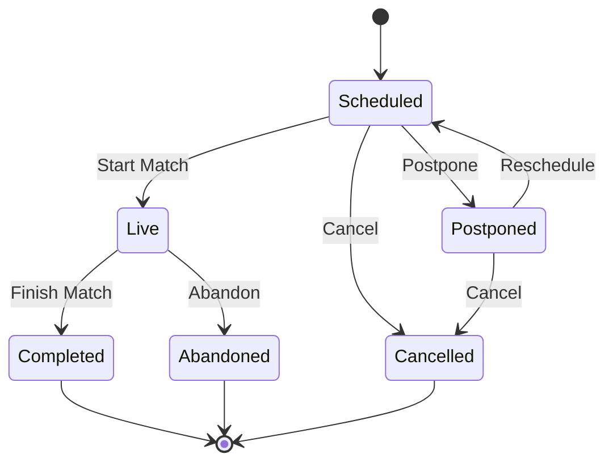

# Cricket Feature Documentation

> **AI Maintenance Prompt**: This documentation should be updated whenever files in the `lib/features/cricket/` directory are modified. Monitor changes to cricket entities (matches, teams, players, scores), use cases, repositories, data sources, models, screens, widgets, and providers. Update this documentation to reflect new cricket functionality, match management features, scoring system changes, team management updates, player statistics modifications, UI enhancements, and API integrations. Keep the cricket domain models, match flow diagrams, scoring algorithms, and integration examples current with the actual implementation.

## Overview

The Cricket feature is the core functionality of the GullyCric application, handling match management, team organization, player statistics, and live scoring. It follows Clean Architecture principles with comprehensive cricket domain modeling.

## Architecture

```
lib/features/cricket/
├── data/
│   ├── datasources/         # Data access layer
│   ├── models/              # Data models with JSON serialization
│   └── repositories/        # Repository implementations
├── domain/
│   ├── entities/            # Cricket business entities
│   ├── repositories/        # Repository interfaces
│   └── usecases/            # Cricket business logic
└── presentation/
    ├── providers/           # State management
    ├── screens/             # Cricket UI screens
    └── widgets/             # Cricket-specific widgets
```

## Domain Layer

### Entities (`domain/entities/`)

#### MatchEntity (`match_entity.dart`)
Represents a cricket match in the business domain.

**Core Properties**:
- `id`: Unique match identifier
- `title`: Match title/name
- `description`: Match description
- `matchType`: Type of match (T20, ODI, Test, etc.)
- `format`: Match format details
- `venue`: Match venue information
- `dateTime`: Scheduled match date and time
- `status`: Current match status
- `teams`: Participating teams
- `tossWinner`: Team that won the toss
- `tossDecision`: Bat or bowl first decision
- `currentInning`: Current inning number
- `innings`: List of innings data
- `result`: Match result
- `createdBy`: User who created the match
- `createdAt`: Match creation timestamp
- `updatedAt`: Last update timestamp

**Match Types**:
```dart
enum MatchType {
  t20,        // Twenty20 format
  odi,        // One Day International
  test,       // Test match
  t10,        // Ten10 format
  hundred,    // The Hundred format
  friendly,   // Friendly/practice match
}
```

**Match Status**:
```dart
enum MatchStatus {
  scheduled,   // Match scheduled but not started
  live,        // Match in progress
  completed,   // Match finished
  cancelled,   // Match cancelled
  postponed,   // Match postponed
  abandoned,   // Match abandoned
}
```

#### TeamEntity (`team_entity.dart`)
Represents a cricket team.

**Properties**:
- `id`: Unique team identifier
- `name`: Team name
- `shortName`: Abbreviated team name
- `logoUrl`: Team logo image URL
- `captainId`: Team captain's player ID
- `wicketKeeperId`: Wicket keeper's player ID
- `playerIds`: List of player IDs in the team
- `homeVenue`: Team's home ground
- `type`: Team type (club, school, corporate, etc.)
- `settings`: Team configuration settings
- `stats`: Team statistics
- `createdBy`: User who created the team
- `createdAt`: Team creation timestamp
- `updatedAt`: Last update timestamp

**Team Types**:
```dart
enum TeamType {
  club,        // Cricket club team
  school,      // School team
  corporate,   // Corporate team
  friends,     // Friends team
  academy,     // Cricket academy team
}
```

#### PlayerEntity (`player_entity.dart`)
Represents a cricket player.

**Properties**:
- `id`: Unique player identifier
- `userId`: Associated user account ID (optional)
- `firstName`: Player's first name
- `lastName`: Player's last name
- `nickname`: Player's nickname
- `dateOfBirth`: Player's date of birth
- `battingStyle`: Batting style (right/left handed)
- `bowlingStyle`: Bowling style and type
- `preferredRole`: Primary playing role
- `jerseyNumber`: Jersey number (optional)
- `careerStats`: Career statistics
- `seasonStats`: Current season statistics
- `createdAt`: Player creation timestamp
- `updatedAt`: Last update timestamp

**Playing Roles**:
```dart
enum PlayerRole {
  batsman,           // Pure batsman
  bowler,            // Pure bowler
  allRounder,        // All-rounder
  wicketKeeper,      // Wicket keeper
  wicketKeeperBat,   // Wicket keeper batsman
}
```

**Batting Styles**:
```dart
enum BattingStyle {
  rightHanded,
  leftHanded,
}
```

**Bowling Styles**:
```dart
enum BowlingStyle {
  rightArmFast,
  leftArmFast,
  rightArmMedium,
  leftArmMedium,
  rightArmSpin,
  leftArmSpin,
  rightArmOffSpin,
  leftArmOffSpin,
}
```

#### ScoreEntity (`score_entity.dart`)
Represents scoring information for a match.

**Properties**:
- `id`: Unique score identifier
- `matchId`: Associated match ID
- `inningNumber`: Inning number (1 or 2)
- `battingTeamId`: Team currently batting
- `bowlingTeamId`: Team currently bowling
- `runs`: Total runs scored
- `wickets`: Wickets fallen
- `overs`: Overs bowled
- `balls`: Balls bowled in current over
- `extras`: Extra runs (byes, leg-byes, wides, no-balls)
- `currentBatsmanIds`: Currently batting players
- `currentBowlerId`: Currently bowling player
- `ballByBall`: Ball-by-ball scoring data
- `partnerships`: Batting partnerships
- `fallOfWickets`: Wicket fall details

### Enums (`domain/entities/match_enums.dart`)
Centralized cricket-specific enumerations.

**Key Enums**:
- `MatchType`: Different match formats
- `MatchStatus`: Match state
- `MatchResult`: Match outcome
- `TossDecision`: Bat or bowl first
- `WicketType`: How a batsman got out
- `ExtraType`: Types of extra runs
- `BoundaryType`: Four or six
- `PlayerRole`: Playing positions
- `BattingStyle`: Batting preferences
- `BowlingStyle`: Bowling types

### Use Cases (`domain/usecases/`)

#### MatchUseCases (`match_usecases.dart`)
Contains all match-related business logic.

**Use Cases**:

##### CreateMatchUseCase
Creates a new cricket match.

**Parameters**:
```dart
class CreateMatchParams {
  final String title;
  final String description;
  final MatchType matchType;
  final String venue;
  final DateTime dateTime;
  final List<String> teamIds;
  final MatchSettings settings;
}
```

**Usage**:
```dart
final result = await createMatchUseCase(
  CreateMatchParams(
    title: 'Sunday League Match',
    description: 'Weekly league match',
    matchType: MatchType.t20,
    venue: 'Central Cricket Ground',
    dateTime: DateTime.now().add(Duration(days: 1)),
    teamIds: ['team1', 'team2'],
    settings: MatchSettings(
      oversPerInning: 20,
      maxOversPerBowler: 4,
    ),
  ),
);
```

##### StartMatchUseCase
Starts a scheduled match.

**Features**:
- Validates match can be started
- Handles toss ceremony
- Initializes scoring system
- Sets up first inning

##### UpdateScoreUseCase
Updates match score in real-time.

**Features**:
- Ball-by-ball scoring
- Automatic calculations
- Wicket handling
- Over completion
- Inning completion

##### GetMatchesUseCase
Retrieves matches with filtering and pagination.

**Parameters**:
```dart
class GetMatchesParams {
  final int limit;
  final int offset;
  final MatchStatus? status;
  final String? userId;
  final DateTime? fromDate;
  final DateTime? toDate;
}
```

## Data Layer

### Models (`data/models/`)

#### MatchModel (`match_model.dart`)
Data model extending MatchEntity with JSON serialization.

**Features**:
- Complete JSON serialization
- Null safety handling
- Enum conversion
- Date/time parsing
- Nested object handling

**Usage**:
```dart
// From JSON
final match = MatchModel.fromJson(jsonData);

// To JSON
final jsonData = match.toJson();

// Convert to entity
final matchEntity = match as MatchEntity;
```

#### TeamModel (`team_model.dart`)
Data model for team information.

**Features**:
- Team data serialization
- Player list management
- Statistics handling
- Settings configuration

#### PlayerModel (`player_model.dart`)
Data model for player information.

**Features**:
- Player data serialization
- Statistics tracking
- Performance metrics
- Career data management

#### ScoreModel (`score_model.dart`)
Data model for match scoring.

**Features**:
- Real-time score updates
- Ball-by-ball data
- Partnership tracking
- Bowling figures

### Data Sources (`data/datasources/`)

#### CricketSimpleDataSource (`cricket_simple_datasource.dart`)
Simplified data source for development and testing.

**Features**:
- In-memory data storage
- Mock match data
- Simulated scoring
- Test team and player data

**Sample Data**:
```dart
// Pre-configured test matches
final testMatches = [
  MatchModel(
    id: 'match_001',
    title: 'Mumbai vs Delhi',
    matchType: MatchType.t20,
    status: MatchStatus.scheduled,
    // ... other properties
  ),
];
```

#### CricketLocalDataSource (`cricket_local_datasource.dart`)
Local storage implementation for offline functionality.

**Features**:
- SQLite database storage
- Offline match data
- Cached statistics
- Local team management

### Repositories (`data/repositories/`)

#### CricketRepositoryImpl (`cricket_repository_impl.dart`)
Main repository implementation.

**Features**:
- Data source coordination
- Network connectivity handling
- Caching strategy
- Error handling and mapping

#### CricketSimpleRepository (`cricket_simple_repository.dart`)
Simplified repository for development.

**Features**:
- Direct data source access
- Simplified error handling
- Development-friendly implementation

## Presentation Layer

### Providers (`presentation/providers/`)

#### CricketProvider (`cricket_provider.dart`)
State management for cricket functionality.

**State Properties**:
- `matches`: List of matches
- `currentMatch`: Currently selected match
- `teams`: Available teams
- `players`: Player data
- `isLoading`: Loading states
- `error`: Error messages

**Methods**:
- `loadMatches()`: Load match list
- `createMatch()`: Create new match
- `startMatch()`: Start a match
- `updateScore()`: Update match score
- `loadTeams()`: Load team data
- `createTeam()`: Create new team

### Screens (`presentation/screens/`)

#### MatchesScreen (`matches_screen.dart`)
Main screen displaying list of matches.

**Features**:
- Match list with filtering
- Search functionality
- Status-based filtering
- Pull-to-refresh
- Infinite scrolling
- Match creation button

**UI Components**:
- Search bar
- Filter chips
- Match cards
- Loading indicators
- Empty state handling

#### CreateMatchScreen (`create_match_screen.dart`)
Screen for creating new matches.

**Features**:
- Multi-step form
- Team selection
- Venue selection
- Date/time picker
- Match settings configuration
- Validation and error handling

**Form Steps**:
1. Basic match information
2. Team selection
3. Venue and timing
4. Match settings
5. Confirmation

#### MatchDetailsScreen (`match_details_screen.dart`)
Detailed view of a specific match.

**Features**:
- Match information display
- Team lineups
- Live score updates
- Match statistics
- Commentary section
- Action buttons (start, join, etc.)

#### ScoreUpdateScreen (`score_update_screen.dart`)
Live scoring interface for matches.

**Features**:
- Ball-by-ball scoring
- Quick scoring buttons
- Wicket recording
- Over completion
- Bowling change
- Inning management

**Scoring Interface**:
- Run buttons (0, 1, 2, 3, 4, 6)
- Extra buttons (wide, no-ball, bye, leg-bye)
- Wicket button with dismissal types
- Undo last ball
- Over summary

### Widgets (`presentation/widgets/`)

Custom widgets would be created as needed for cricket-specific UI components.

## Cricket Domain Logic

### Match Flow



### Scoring System

#### Ball-by-Ball Scoring
```dart
class BallData {
  final int runs;
  final bool isWicket;
  final WicketType? wicketType;
  final String? dismissedPlayerId;
  final ExtraType? extraType;
  final bool isBoundary;
  final BoundaryType? boundaryType;
}
```

#### Over Management
```dart
class Over {
  final int overNumber;
  final String bowlerId;
  final List<BallData> balls;
  final int runs;
  final int wickets;
  final bool isMaiden;
}
```

#### Partnership Tracking
```dart
class Partnership {
  final String batsman1Id;
  final String batsman2Id;
  final int runs;
  final int balls;
  final DateTime startTime;
  final DateTime? endTime;
}
```

### Statistics Calculation

#### Batting Statistics
```dart
class BattingStats {
  final int matches;
  final int innings;
  final int runs;
  final int highestScore;
  final int notOuts;
  final double average;
  final double strikeRate;
  final int centuries;
  final int halfCenturies;
  final int fours;
  final int sixes;
}
```

#### Bowling Statistics
```dart
class BowlingStats {
  final int matches;
  final int innings;
  final double overs;
  final int runs;
  final int wickets;
  final int bestFigures;
  final double average;
  final double economy;
  final double strikeRate;
  final int maidens;
  final int fiveWickets;
}
```

## Integration Examples

### Authentication Integration
```dart
class CricketProvider extends ChangeNotifier {
  final AuthProvider _authProvider;
  
  Future<void> createMatch(CreateMatchParams params) async {
    final currentUser = _authProvider.currentUser;
    if (currentUser == null) {
      throw AuthException('User must be logged in to create matches');
    }
    
    final matchParams = params.copyWith(createdBy: currentUser.id);
    final result = await _createMatchUseCase(matchParams);
    
    result.fold(
      (failure) => _handleError(failure),
      (match) => _handleMatchCreated(match),
    );
  }
}
```

### Navigation Integration
```dart
// Navigate to match details
void _onMatchTap(MatchEntity match) {
  context.push('/matches/${match.id}');
}

// Navigate to scoring screen
void _startScoring(MatchEntity match) {
  if (match.status == MatchStatus.live) {
    context.push('/matches/${match.id}/score');
  }
}
```

## Testing Strategy

### Unit Tests
```dart
void main() {
  group('CreateMatchUseCase', () {
    late CreateMatchUseCase useCase;
    late MockCricketRepository mockRepository;

    setUp(() {
      mockRepository = MockCricketRepository();
      useCase = CreateMatchUseCase(repository: mockRepository);
    });

    test('should create match successfully', () async {
      // Arrange
      final params = CreateMatchParams(
        title: 'Test Match',
        matchType: MatchType.t20,
        // ... other params
      );
      
      when(mockRepository.createMatch(any))
          .thenAnswer((_) async => Right(mockMatch));

      // Act
      final result = await useCase(params);

      // Assert
      expect(result, Right(mockMatch));
    });
  });
}
```

### Widget Tests
```dart
void main() {
  testWidgets('MatchesScreen displays matches correctly', (tester) async {
    // Arrange
    final mockMatches = [mockMatch1, mockMatch2];
    
    await tester.pumpWidget(
      MaterialApp(
        home: MatchesScreen(),
      ),
    );

    // Act
    await tester.pumpAndSettle();

    // Assert
    expect(find.text('Mumbai vs Delhi'), findsOneWidget);
    expect(find.byType(MatchCard), findsNWidgets(2));
  });
}
```

## Performance Considerations

### Optimization Strategies
- Lazy loading of match data
- Efficient list rendering with pagination
- Image caching for team logos
- Background score updates
- Minimal UI rebuilds during scoring

### Real-time Updates
- WebSocket integration for live scores
- Optimistic UI updates
- Conflict resolution for concurrent updates
- Offline score caching

## Future Enhancements

### Planned Features
- [ ] Advanced statistics and analytics
- [ ] Tournament management
- [ ] Live streaming integration
- [ ] Social features (comments, sharing)
- [ ] Weather integration
- [ ] Umpire tools and features
- [ ] Fantasy cricket integration
- [ ] Video highlights
- [ ] Player performance analysis
- [ ] Team comparison tools

### Technical Improvements
- [ ] Real-time collaboration
- [ ] Advanced caching strategies
- [ ] Machine learning for insights
- [ ] Voice commentary
- [ ] Augmented reality features

---

**Last Updated**: December 2024  
**Maintainer**: GullyCric Development Team  
**Next Review**: When cricket features are modified